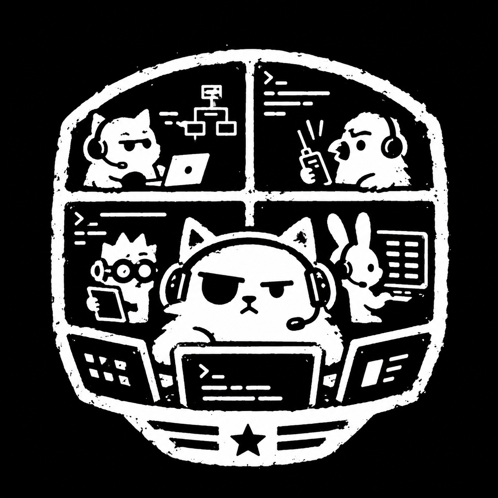

# gang

<p align="center">
  
</p>

A minimal, **observable** subagent primitive for [Pi](https://github.com/earendil-works). Fire up
subagents as **visible tmux panes** you watch live, let them talk over a **cross-agent message
bus**, and observe everything three ways: live panes, a durable log, and a mission-control view —
in your terminal (a Pi overlay) **and** in the browser.

Built on a vendored, fully-owned copy of [pi-intercom](https://github.com/nicobailon/pi-intercom)
(MIT). No external `pi-intercom` runtime dependency; npm deps install with the package.
Targets `@earendil-works` Pi **0.80.2**.

```
┌─ tmux panes ──────────────┐   raw per-agent view — watch each member's pi session
│  boss     │ worker        │
│           │ reviewer      │
└───────────┴───────────────┘
        │ intercom (unix socket: ~/.pi/agent/intercom/broker.sock)
        ▼
┌─ owned broker (vendored) ────────────────────┐
│  • routes messages                            │
│  • TAP  → ~/.pi/agent/intercom/intercom.jsonl │  durable, greppable, replayable
│  • HTTP + SSE :7717  ─────────────────────────┼─► mission control:  /gang watch  (in Pi)
└───────────────────────────────────────────────┘                     127.0.0.1:7717 (browser)
```

## Requirements

- **Pi** (`@earendil-works/pi-coding-agent`) ≥ 0.80.2 — `pi --version`
- **tmux** — members run as visible panes (`brew install tmux`)
- **Node** ≥ 22

## Install

### Option A — from GitHub (recommended)

Pi packages run local extension code with your user permissions, so review the source before
installing. Pi installs the package's runtime dependencies for you on a git install:

```sh
pi install ssh://git@github.com/Jeecabs/gang     # private repo → uses your SSH key
pi list                                           # verify: should list  gang
```

### Option B — local clone (to hack on it)

```sh
git clone git@github.com:Jeecabs/gang.git
cd gang
npm install                                       # REQUIRED — the broker + GUI run from node_modules
pi install .                                       # persistent: registers it in your Pi settings
# …or load it for a single session without touching settings:
pi -e ./src/intercom/index.ts -e ./src/gang/index.ts
```

> ⚠️ A **local** install (`pi install .`) references the folder **in place** and does **not** run
> `npm install` for you — so run it yourself, and don't move or delete the folder (the broker
> launches from its `node_modules`). A git/npm install handles deps automatically.

Unsure about Pi extensions in general? Pi documents itself — just ask it:
`pi -p "how do I write and install a Pi extension?"`

## Use

In any Pi session, ask for a member — or call the tool yourself. The session adopts the **`boss`**
identity the first time you spawn (not before), so sessions where you never use gang keep their
natural title in `pi -r`:

```
/gang spawn list the repo's largest files
/gang spawn @reviewer -t high review the diff carefully
```

`gang spawn` returns immediately and opens a tmux pane. The member does the task in its own Pi
session and sends the result **back to boss as an intercom message** (it does not return inline).
Keep working; handle the result when it arrives.

Watch the gang three ways:

```sh
# 1. in Pi — live mission-control overlay (members + status + feed)
/gang watch            # or press  alt+g

# 2. in the browser — the same feed, richer
/gang url              # prints computed loopback URL from GANG_GUI_PORT
open http://127.0.0.1:7717

# 3. durable, greppable log of every cross-agent message
tail -f ~/.pi/agent/intercom/intercom.jsonl
```

## Commands & tools

| Surface | What |
|---|---|
| `gang` tool | `{action:"spawn", task, role?, thinking?}` · `{action:"list"}` · `{action:"clean", force?, all?}` · `{action:"stop", role? finished?}` · `{action:"name", name}` — model-callable |
| `/gang` | show the roster |
| `/gang spawn [@name] [-t <level>] <task>` | spawn a member by hand; name optional (auto `m1`, `m2`, …). Levels: `off`, `minimal`, `low`, `medium`, `high`, `xhigh` |
| `/gang clean` · `/gang clean --force` · `/gang clean all` | `clean` reaps dead/missing panes and prunes stale roster entries; `clean --force` also kills members that already reported back; `clean all` stops this boss's members (detached mode kills the `gang` session; in-tmux mode kills direct member panes only) |
| `/gang stop <member>` · `/gang stop --all-finished` | stop one member immediately, or bulk-stop any member already reapable (`reported_done`, `pane_dead`, `pane_missing`) |
| `/gang url` | show the browser mission-control URL (`http://127.0.0.1:<GANG_GUI_PORT>`) |
| `/gang name [name]` | show or set this agent/session's own name |
| `/gang watch` · `alt+g` | open mission control (in-Pi overlay) |
| `intercom` tool | message any session: `list` / `send` / `ask` / `reply` |

Env knobs: `GANG_GUI_PORT` (default `7717`), `GANG_TMUX_BIN` (default Homebrew tmux), `GANG_FEED_HOURS` (mission-control feed recency window, default `6`).

Finished members linger on purpose — their panes stay (`remain-on-exit on`) so you can read the final state. Reap them when you're done with `/gang clean` (or `gang({ action: "clean" })`). If a member has already reported back but its pane is still hanging around, use `/gang clean --force` or `/gang stop --all-finished`. `/gang stop <member>` is the first-class escape hatch when you know a specific pane should die. `/gang clean all` tears down the detached `gang` session outside tmux; inside tmux it kills this boss's direct member panes only.

Agent naming: an unnamed orchestrator session claims `boss of <current-folder>` (e.g. `boss of private-evals`) **on its first spawn**, not at startup — so plain Pi sessions stay unnamed in the `pi -r` resume list. Use `/gang name <name>` before spawning to pick a custom target; spawned members get that exact supervisor name. Member task prompts also tell agents to name themselves with `gang({ action: "name", name: "<clear role/name>" })` before spinning up their own teammate.

## How it's wired

`package.json` → `pi.extensions` points Pi at two TypeScript entry files it loads on startup:

- `src/intercom/` — vendored pi-intercom: the broker, client, and the `intercom` /
  `contact_supervisor` tools. **Owned** — imports retargeted to `@earendil-works/*`, plus a broker
  message **tap** (durable log) and an embedded **HTTP/SSE** mission-control server.
- `src/gang/` — the `gang` tool (spawn members in tmux, list the roster), the `/gang watch`
  overlay, and boss auto-naming.

`gang spawn <task>` (optionally `@name`) launches `pi --name <name> … @<taskfile>` in a tmux pane with five
`PI_SUBAGENT_*` env vars. Pass `--thinking <level>` to add Pi's `--thinking` flag for that member.
The vendored intercom extension reads the env vars at child startup to register
the member on the bus and unlock its `contact_supervisor` tool — that's the whole contract:

| Env var | Set to | Effect |
|---|---|---|
| `PI_SUBAGENT_INTERCOM_SESSION_NAME` | `<role>` | member's intercom identity |
| `PI_SUBAGENT_ORCHESTRATOR_TARGET` | current supervisor name (`boss of <folder>` or custom `/gang name`) | who it reports to |
| `PI_SUBAGENT_RUN_ID` / `_CHILD_AGENT` / `_CHILD_INDEX` | run metadata | unlocks `contact_supervisor` |

(The member's addressable **name** comes from Pi's `--name` flag; the supervisor self-names
lazily to the computed or custom `orchestratorName`.)

## Develop

```sh
npm test             # vendored intercom suite + gang/tmux/tap/GUI/overlay tests
npm run typecheck    # strict TypeScript check
```

## Credits

Vendors [pi-intercom](https://github.com/nicobailon/pi-intercom) by Nico Bailon (MIT). See `NOTICE`.
Built on Pi by the [earendil-works](https://github.com/earendil-works) team.
